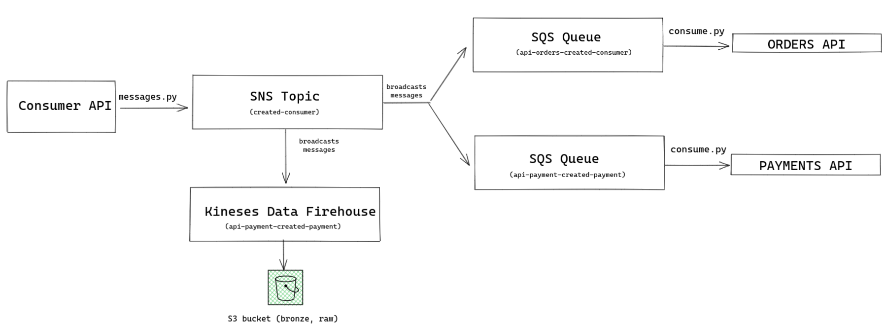
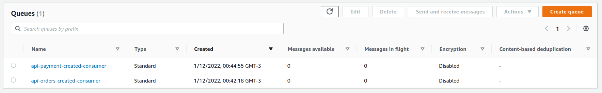
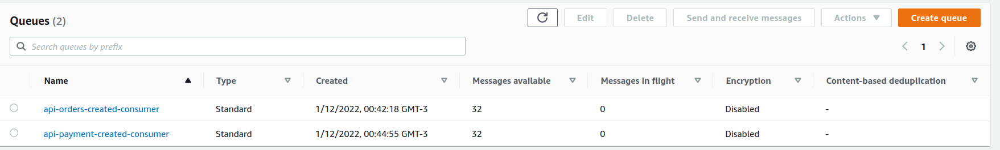
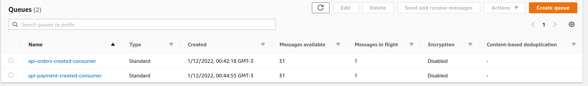
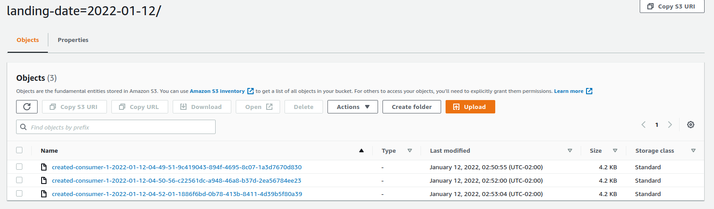

# Messaging

## Introduction

This project was built to simulate a microsservice based on messaging to replace a monolitc infrastructure. All of the infrastrcture can be built using cloudformation (infra.yaml file).
The infrastructure is based on an hypothetical e-commerce. The information stored is based on consumers, orders and payments.

##### Infrastructure and project overview:
* S3 bucket: where the files genereted by the kinese firehose are stored. 
* SNS topic - created-consumer: A topic that will be thriggered when running "message.py" file and broadcasts the messages.
* SQS queue - api-orders-created-consumer: a queue that will store the messages and can be consumed by orders API.
* SQS queue - api-payment-created-payment: a queue that will store the messages and can be consumed by payment API.
* Kineses Data Firehose: a kinese instance that we receive the messages and store then for a few moments (or until a size limit is reached) and then save then into the S3 bucket.



First there is a topic that represents a consumer created. Every time that a new message is created by this topic it is broadcasted and the queues of orders and payments stores it, and than they are ready to be consumed by APIs, for example. To generate a message it is needed to run "message.py" (this script creates a message every fice seconds).
To simulate a queue message consumption run "consume.py" file. It fakes a message receive by some API (payment and order).
The Kineses Data Firehose will automatically receive the message and store it for 60 seconds or until there is 5Mbs of data, and then store the data received througth the messages into the S3 bucket partiotioning by landing date (landing_date=YYYY-MM-dd).

## Tecnologies and tools used
* Language: Python 3.8
* AWS Services: SQS, SNS, S3, Kineses Firehose, Cloudformation

## How to run and evaluate

Install requirements:
```
pip install -r requirements.txt
```

Upload the file "infra.yaml" to AWS at cloudformation section.
Wait for the stack to be created. It may take a while.

Cofigure a .env file with the following variables:
```
ACCESS_KEY=<your_access_key>
SECRET_KEY=<your_secret_key>
ARN=<topic_created-consumer_arn>
URL_ORDERS=<api-payment-created-consumer_url>
URL_PAYMENTS=<api-payment-created-payment_url>

```

Send the messages running :
```
python3 message.py
```
This will send random data to the two queues that was creates.
Before running "message.py"

After a few time after started running "message.py"


About 32 messages were sent to the queue at the moment that the screenshot was taken.

To consume the messages in SQS api-orders-created-consumer and api-payment-created-consumer use the command:



```
python3 consume.py
```

The Kineses Data Firehose worked if the messages were consumed as files at S3 bucket would be created.



